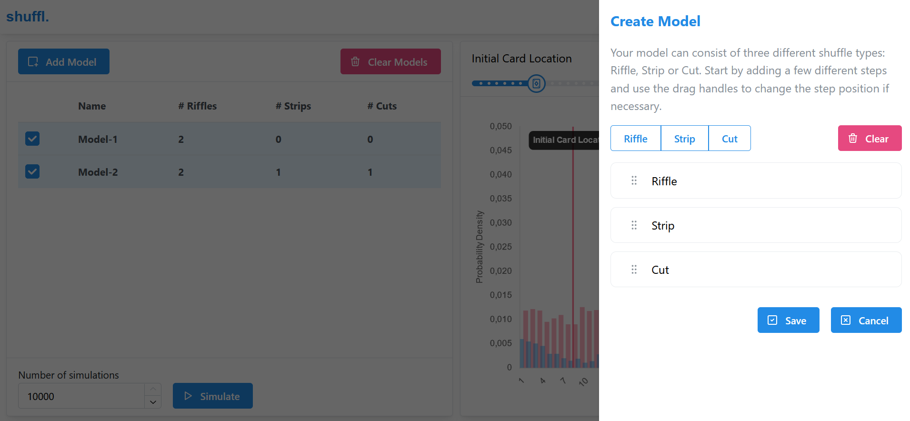
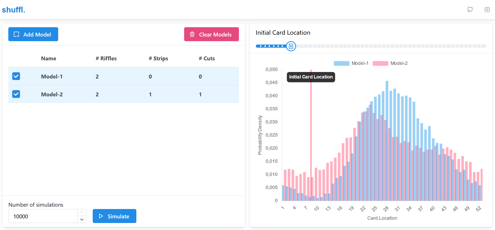

# shuffl | Model, Simulate and Analyze Card Shuffles

**shuffl** is a web-application that allows you to build models for shuffling playing cards, run simulations with these models and use interactive charts to visualize the results.

The application is deployed on Vercel and you can check it out and play with it [here](https://shuffle-and-cut.vercel.app).

You can choose between three different shuffle types to build your shuffle model: Riffle, Strip and Cut:



After running your simulation, you can visualize the resulting probability density for each initial card location and you can compare the effect of different shuffles:



My interest in the statistics of playing card shuffles was sparked by reading the paper by
[Bayer and Diaconis](https://www.jstor.org/stable/2959752). I could not find a suitable tool to run my own experiments so I set out to build it myself. Eventually, this led to the hobby project **shuffl**.

## Development

The frontend of **shuffl** is written in [React.js](https://react.dev/) and utilizes [Next.js](https://nextjs.org/). The backend is written in Python based on [FastAPI](https://fastapi.tiangolo.com/).

To run the backend server, first create a new Python environment and install the necessary dependencies:

- Install and activate new Python environment
  ```
  python -m venv .venv
  ```
  ```
  .\.venv\Scripts\activate
  ```
- Install all Python dependencies
  ```
  pip install -r requirements.txt
  ```
- [Optional] Install pre-commit hooks for the backend
  ```
  pre-commit install
  ```

Then you can run the backend locally with uvicorn as follows:

```
python -m uvicorn "api.index:app" --reload
```

The backend then runs on [http://127.0.0.1:8000](http://127.0.0.1:8000). You can run the tests for the backend with `pytest`.

To run the frontend, install the necessary dependencies with `npm install` and then run the frontend locally in development mode with `npm run dev`. Open [http://localhost:3000](http://localhost:3000) with your browser to see the frontend of **shuffl**.
